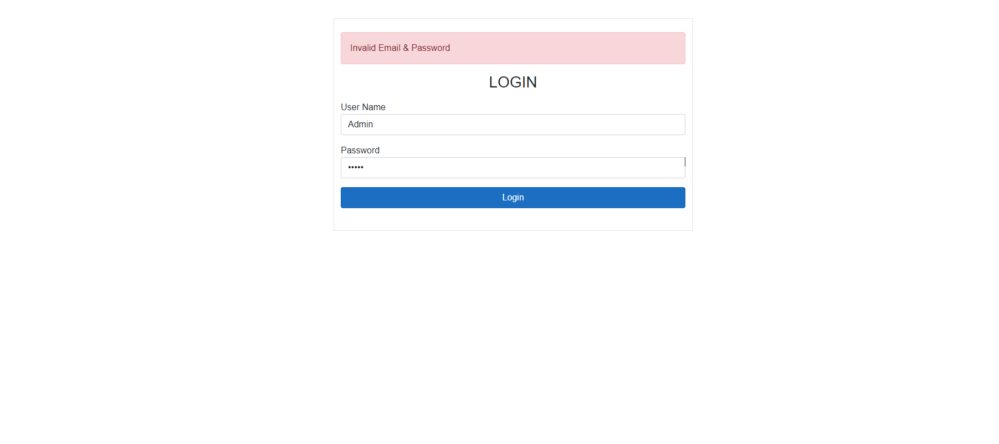
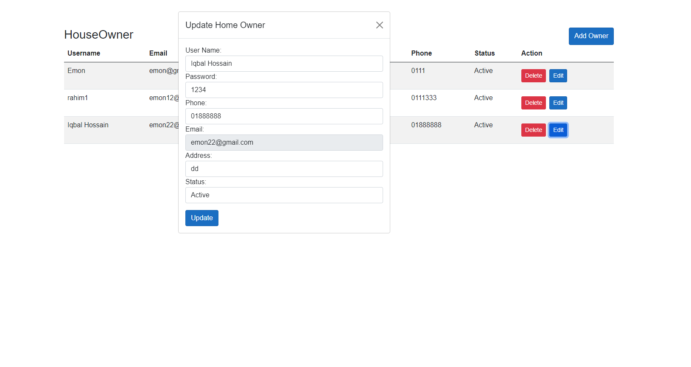

# HomeRentManageMent

The HomeRentManagement system is a software platform designed to assist property owners, and tenants in efficiently handling various aspects of rental property management

## Demo

   
 .png)
 
 .png)
 .png)
 .png)
 .png)
 .png)
 .png)
 
 
 
 
## 🗝 Features

- ✅ There are 2 stakeholders in this project: Admin and House Owner.
- ✅ Admin can create and manage Users (House Owners), Roles, and Statuses.
- ✅ Owners can add and manage house details.
- ✅ Owners can add and manage house unit details.
- ✅ Owners can add and manage tenant details.
- ✅ Owners can generate bills for tenants in PDF format.
- ✅ Owners can track the bill status.

## 💻  Installation Steps
Clone or download this project in your working directory, Open using android studio, Sync the project, build & run the project.
## 🧑 Author
Mohammad Iqbal Hossain Emon
- [@github](https://github.com/iqbal-emon)

